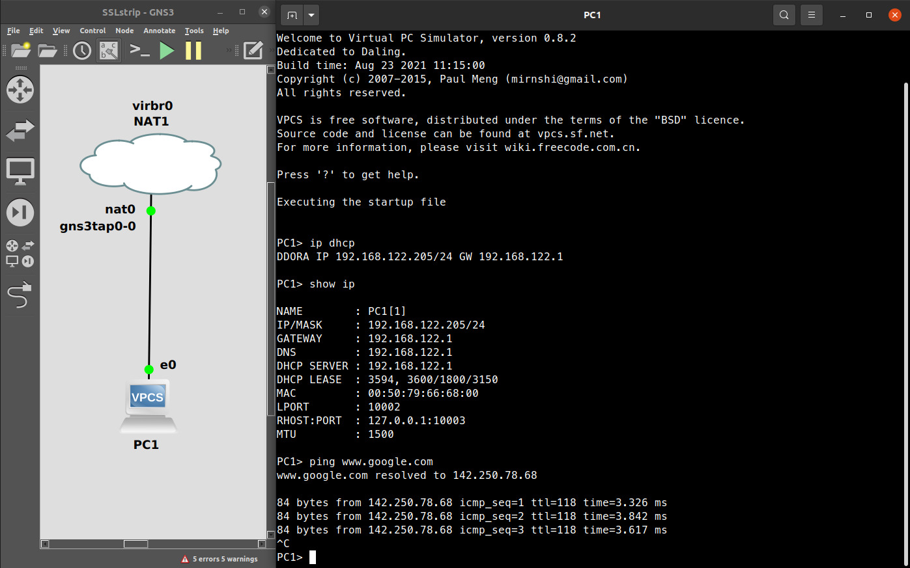
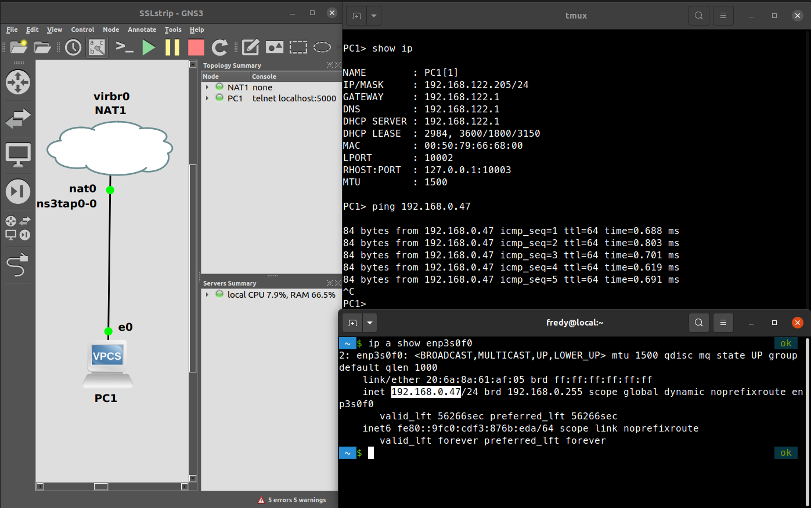

Abstract: poner un resumen de pocas lineas acá.
<!--more-->

## Requisitos
* Plantilla de router con Imagen IOU L3 [`i86bi-linux-l3-adventerprisek9-15.4.1T.bin`](https://drive.google.com/file/d/0B35cvHMiBThNaERiaUNtWjctcXc/view?resourcekey=0-UCnBqKJOfAF2UTIXfuWu_w)  
* 

### DHCP, Dynamic Host Configuration Protocol 
```
enable
config terminal
show running-config
interface ethernet 0/0
ip address dhcp
no shutdown
interface ethernet 0/1
ip address 192.168.244.1 255.255.255.0
no shutdown
end 
wr
show ip interface brief
```

En PC
```
ip addr add 192.168.244.2/24 brd + dev eth0
```

### NAT forwarding (aka "virtual networks")
GNS3 en linux utiliza `libvirt` para virtualizar redes. Mas exactamente para crear un switch de red virutal<sup>[1]</sup>. Por defecto todos las VM de libvirt se conectan a la misma red virutal **default**<sup>[2]</sup>. Listemos los dispositivos virtuales de red que `libvirt` tenga configurados:

```bash
virsh net-list --all
```
```bash
Name                 State      Autostart 
-----------------------------------------
default              active     yes
```

Obtenemos la configuración del dispositivo `default`

```bash
virsh net-dumpxml default 
```
```xml
<network>
  <name>default</name>
  <uuid>8a48e945-1bda-46d8-afc4-4b5f6af50383</uuid>
  <forward mode='nat'>
    <nat>
      <port start='1024' end='65535'/>
    </nat>
  </forward>
  <bridge name='virbr0' stp='on' delay='0'/>
  <mac address='52:54:00:e5:79:60'/>
  <ip address='192.168.122.1' netmask='255.255.255.0'>
    <dhcp>
      <range start='192.168.122.2' end='192.168.122.254'/>
    </dhcp>
  </ip>
</network>
``` 

De la configuración anterior podemos notar la palabra *NAT* y *DHCP*. Esto quiere decir que este switch virutal no solo opera en la capa 2 de OSI sino también actúa como un dispositivo de capa 3 al modificar el encabezado de IPv4 de los paquetes. Además, *libvirt* utiliza [`dnsmasq`](https://thekelleys.org.uk/dnsmasq/doc.html) para configurar un servidor DHPC<sup>[1]</sup>


Fuente: https://wiki.libvirt.org/page/VirtualNetworking

Verificamos la IPv4 con el comando `ip address show virbr0`:
```bash
ip a sh virbr0
```
```
4: virbr0: <NO-CARRIER,BROADCAST,MULTICAST,UP> mtu 1500 qdisc noqueue state DOWN group default qlen 1000
    link/ether 52:54:00:e5:79:60 brd ff:ff:ff:ff:ff:ff
    inet 192.168.122.1/24 brd 192.168.122.255 scope global virbr0
       valid_lft forever preferred_lft forever
```

Es precisamente este dispotivo `virbr0` (junto con un dispositivo [TAP](https://www.kernel.org/doc/html/v5.8/networking/tuntap.html)) el que GNS3 utiliza detrás de bambalinas para crear un *nodo NAT*. Intentemos hacer un ping a Google:



Inclusive podemos comunicar el PC huesped `VPC1` con el PC anfitrión:




## Servidor HTTP
Crearmos nuetra página de inicio de sesión
```html
<!DOCTYPE html>
<html>
<body>
<h2>Login</h2>
<form method="post" action="<?php echo $_SERVER['PHP_SELF']?>">
	<label for="fname">First name:</label><br>
	<input type="text" id="fname" name="fname" value="John"><br>
	<label for="lname">Last name:</label><br>
	<input type="text" id="lname" name="lname" value="Doe"><br><br>
	<input type="Submit" name="submit_button" value="Login" />
</form> 

</body>
</html>
```

Lanzamos el servidor HTTP con el [servidor incluido en php](https://www.php.net/manual/en/features.commandline.webserver.php)
```bash
php -S 0.0.0.0:8000
```


[1]: https://wiki.libvirt.org/page/VirtualNetworking
[2]: https://access.redhat.com/documentation/en-us/red_hat_enterprise_linux/8/html/configuring_and_managing_virtualization/configuring-virtual-machine-network-connections_configuring-and-managing-virtualization#virtual-networking-default-configuration_understanding-virtual-networking-overview